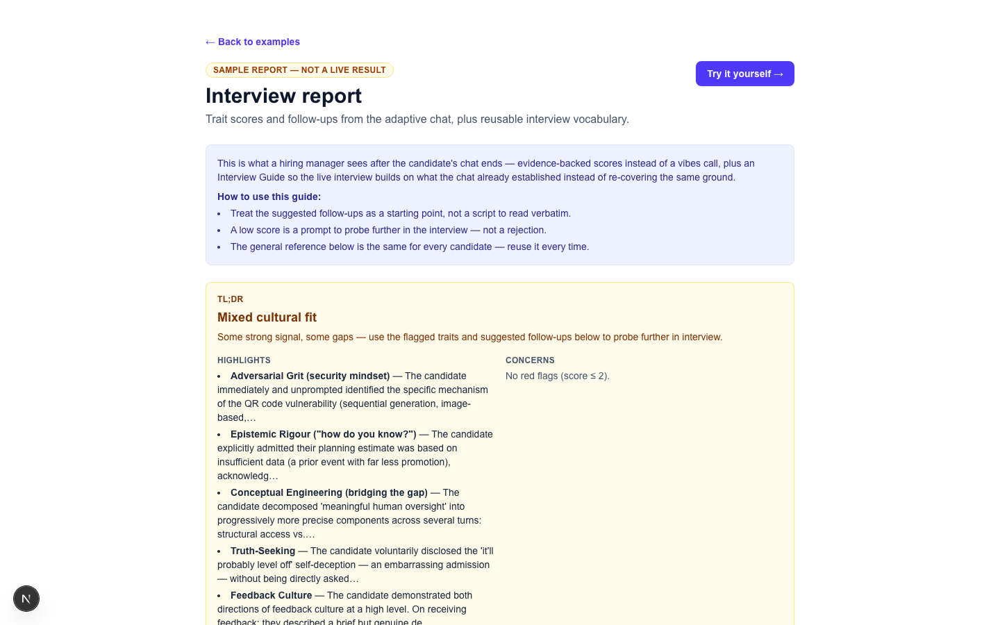
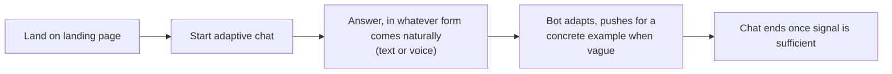
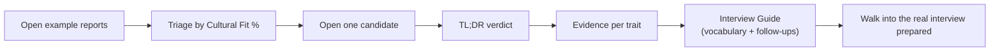

# Trait Chat

An adaptive interview chat that gives people ops teams a shared, evidence-backed vocabulary for
judgment traits that are hard to teach and hard to score from a CV.

## Contents

- [Overview](#overview)
- [Problem](#problem)
- [Solution](#solution)
- [Tailored to a specific organisation](#tailored-to-a-specific-organisation)
- [Walkthrough](#walkthrough)
- [Example candidate reports](EXAMPLES.md)
- [Limitations and what's next](#limitations-and-whats-next)
- [Related](#related)
- [Built with](#built-with)

## Overview

Built by Georgia Hirth, solo, as a follow-on to a hackathon submission:
[calibre-ai-safety-hackathon](https://github.com/HoopieUX/calibre-ai-safety-hackathon), built in a
single day with Emilio Noriega Farres and Marta Albertini Rios at the Breaking Barriers to AI
Safety Hackathon, run by the London Initiative for Safe AI (LISA) and BlueDot Impact — placed 3rd.

That submission scored candidates on role-specific skills plus four "unteachable" judgment traits.
This repo picks up one piece of it and takes it further, on my own: making the traits vocabulary
something a people ops team could actually use live in an interview, not just a scoring rubric
sitting in a spreadsheet.

## Problem

Two problems, on both sides of the table.

**For people ops teams**, finding the right people for AI safety roles is hard in the first
place — the existing pipelines into the field are narrow and high-touch, so promising candidates
from outside them are easy to miss. And once someone's in front of you, assessing traits like
these is currently a vibes call. There's no shared vocabulary for what "good epistemic rigour" or
"good strategic foresight" actually sounds like in conversation, so two interviewers can score the
same answer differently, and rejecting someone as "not a culture fit" is hard to make objective or
explain. Interview time is expensive, and too much of it gets spent re-covering ground rather than
probing what's still unclear.

**For candidates**, a polished written answer takes a long time to produce, and most candidates
already lean on AI to help write it, which quietly defeats the point of asking an "unteachable"
question in the first place — it starts measuring writing and editing skill rather than the
judgment underneath.

## Solution

An adaptive chat replaces the static written question. It follows what the candidate actually
says, asks one question at a time, and pushes for a concrete example when an answer is vague,
rather than working through a fixed script. When it's done, the hiring manager gets:

- A score per trait, with quoted evidence, not just a number
- A TL;DR verdict and a quick-scan of strengths and gaps
- An Interview Guide: the vocabulary for what each trait sounds like weak through to strong, plus
  specific follow-up questions for whatever the chat left unclear

The four traits are the same ones from the original submission (full detail there):

- **Adversarial Grit** (security mindset) — finding the failure before it happens
- **Epistemic Rigour** — discomfort with unearned certainty, including your own
- **Strategic Foresight** — reasoning about risks that don't exist yet
- **Conceptual Engineering** — decomposing a vague value into something measurable

Two things from interview science shaped the design — not as proof this works, but as the
reasoning behind it. Structured interviews with anchored rating scales predict job performance
better than unstructured ones (a Schmidt and Hunter meta-analysis puts the gap at .51 vs .38
predictive validity), and the technique for telling real capability apart from a rehearsed answer
is testing whether it transfers to a situation the candidate hasn't already prepared for (Google's
own guide to structured interviewing names this directly). Both are built into the chat itself and
into the follow-up questions it generates.

## Tailored to a specific organisation

The four traits above are universal — the same for any AI safety role, at any org. But the chat
can also be tailored to one specific organisation's own stated culture, blended into the same list
rather than kept separate.

Apollo Research publishes its own culture explicitly: *"we aim for a culture that emphasizes
truth-seeking, being goal-oriented, giving and receiving constructive feedback, and being friendly
and helpful."* Those four became four more traits, written with the same rigour as the original
four (a 1/3/5 anchor scale, a probe question, quoted evidence required), and blended straight into
the same chat and the same report — the candidate isn't told which questions are "universal" and
which are "Apollo-specific," and neither is the scorer. One example candidate, Taylor, demonstrates
the full eight-trait version end to end:

Universal traits (Adversarial Grit, Epistemic Rigour, Conceptual Engineering) and Apollo-specific
ones (Truth-Seeking, Feedback Culture) sitting in the same highlights list — not two separate
sections — is the point: the assessment reads as one coherent read on the candidate, tailored to
this org, not a generic layer with a company-specific add-on bolted beside it.

See [EXAMPLES.md](EXAMPLES.md) for Taylor's full report in text, alongside the four other example
candidates.

## Walkthrough

**Candidate flow:**

**Hiring-manager flow:**

See [WALKTHROUGH.md](WALKTHROUGH.md) for the full step-by-step version of both flows.

## Limitations and what's next

This is a proof of concept, not a validated tool, and I want to be upfront about that.

- The example candidates in the walkthrough are illustrative — scripted inputs run through the
  real chat and scoring, to show the mechanism actually works end to end, not a validation study
  or evidence the trait framework predicts real job performance.
- No real interviews or hires have been run through it yet.
- There's no calibration mode yet for checking whether two interviewers using the same Interview
  Guide would actually agree.
- It covers judgment traits — universal and organisation-specific — not the role-specific hard
  skills side of the original rubric.
- The organisation-specific traits are currently hardcoded for Apollo Research, not a general
  configurable-per-company system.

## Related

The hackathon submission this evolves:
[calibre-ai-safety-hackathon](https://github.com/HoopieUX/calibre-ai-safety-hackathon)

## Built with

Next.js (App Router), React, TypeScript, and Tailwind CSS, with the Anthropic API for the adaptive
chat and scoring.
