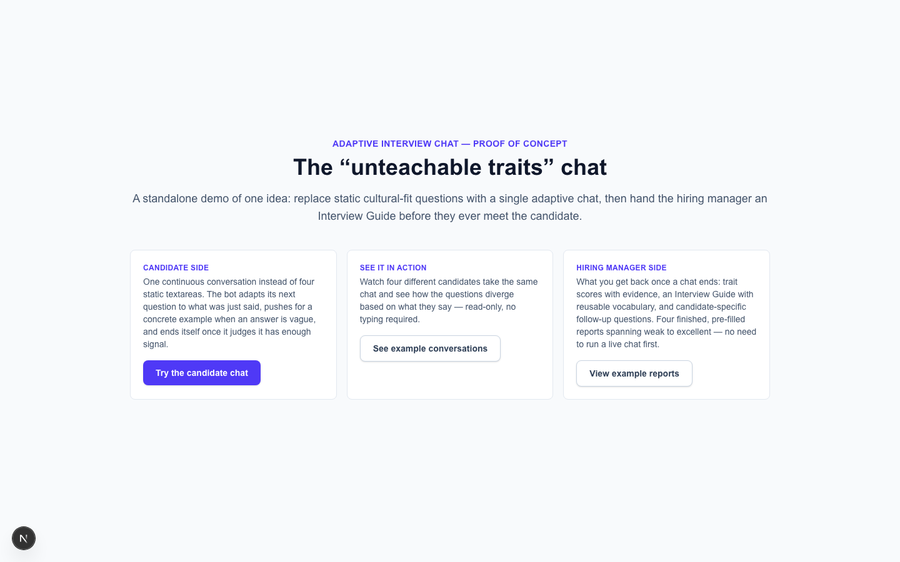
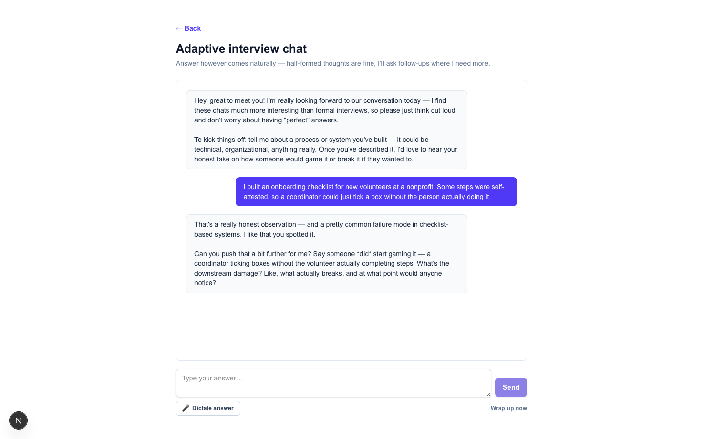
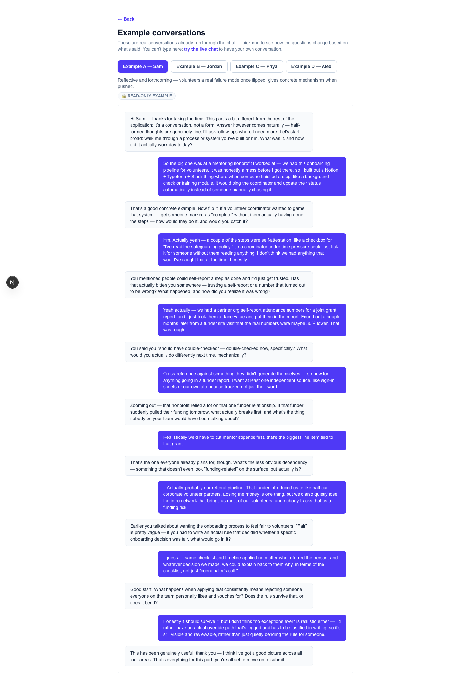
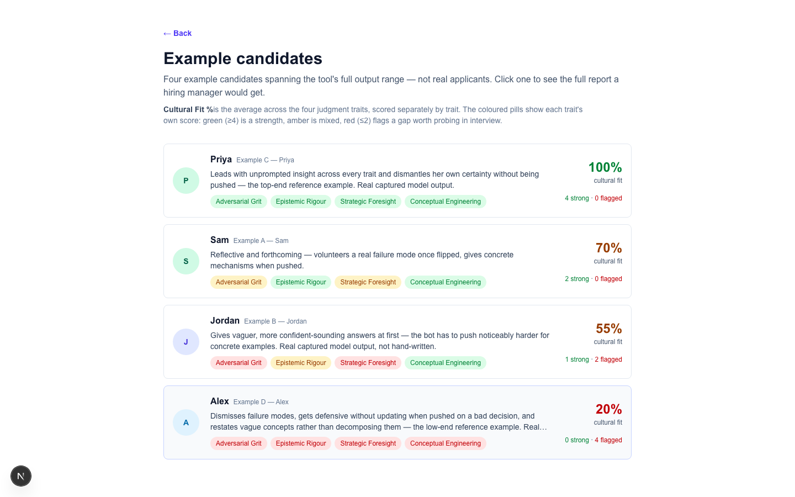
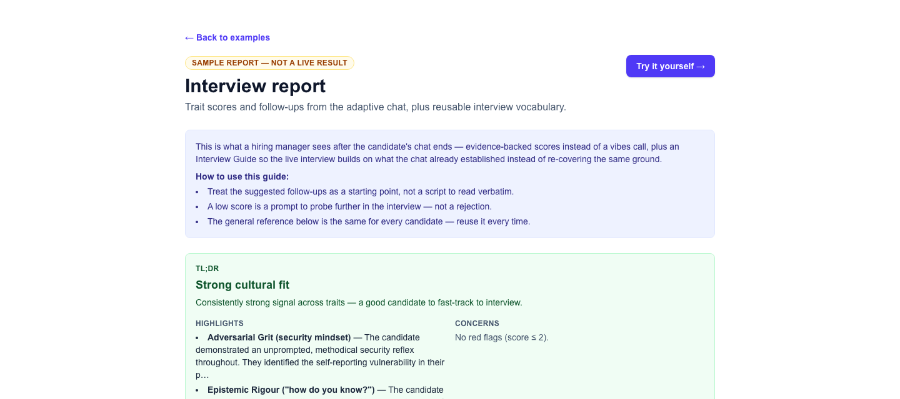

# Walkthrough

The full screenshot-by-screenshot version of the two user flows summarised in
[README.md](README.md#walkthrough).

## Flow 1 — Candidate takes the chat

Three ways in: try the live chat, watch example conversations, or view example reports — nobody
has to commit to a full conversation just to see what this is.

It opens automatically with a question — no blank page, no "click to start." Answer however comes
naturally, by typing or dictating with the mic button; half-formed thoughts are genuinely fine.

- **Stream-of-consciousness over polish** — the chat is evaluated the same way regardless of how
  good someone is at writing, so there's no tax on people who think better out loud than on a page.
- **Pushes for concrete examples** — a vague answer gets a follow-up, not a pass.
- **Ends itself** — the bot decides when it has enough signal, typically after 8-12 exchanges,
  hard-capped so it can never run long. The candidate can also ask to wrap up early.

A read-only way to see the mechanism without having a conversation yourself — pick between four
candidates and watch how the questions actually diverged based on what each one said.

- **Real conversations, not mockups** — two of these four were actually run through the live chat
  and scoring endpoints, not written by hand.
- **Makes the adaptiveness visible** — same opening question, genuinely different follow-ups,
  because the bot is reading what was actually said rather than working through a fixed script.

## Flow 2 — Hiring manager reviews

Four example candidates, sorted by Cultural Fit %, each shown as a card: avatar, a one-line
summary, a coloured pill per trait, and a "X strong / Y flagged" count.

- **Cultural Fit % is its own number** — not blended with anything else, so it stays visible
  rather than getting averaged away.
- **Coloured pills per trait** for instant scanning across candidates before opening any of them.

Drilling into one candidate: a TL;DR with a verdict (strong / mixed / weak cultural fit),
highlights, and concerns. Below the fold (not pictured here), every trait is broken down
individually with its score, rationale, a quoted piece of evidence from the transcript, and —
where the evidence was thin — a suggested follow-up question for the live interview, plus a
general reference section for what each trait sounds like, weak through strong, the same for every
candidate.

- **TL;DR is a rule applied to the scores, not a separate AI judgement** — a starting point, not a
  verdict.
- **Every score is backed by a quote from the actual transcript**, so a hiring manager can check
  whether the rationale holds up.
- **Suggested follow-ups test whether the trait transfers** to a new situation, rather than just
  re-asking the same thing a different way — the technique for telling real capability apart from
  a rehearsed answer.
